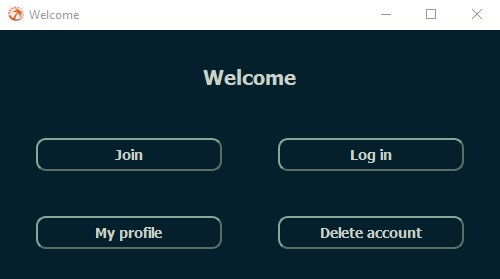
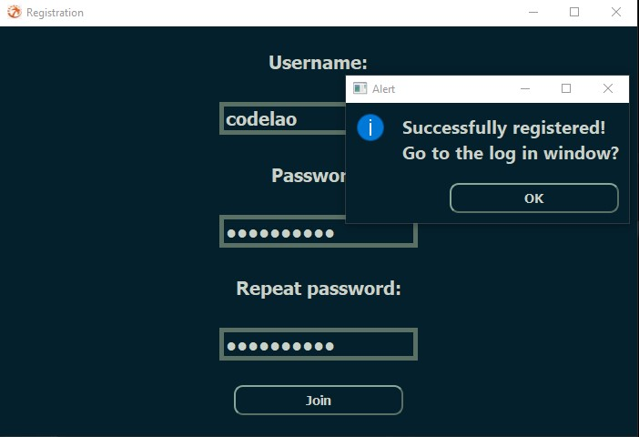
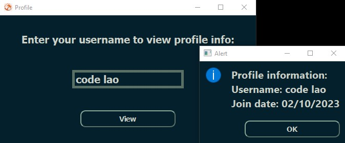

<h1 align="center">PyQt5 Authentification App</h1>

<h3 align="center">
  PyQt5 app with the possibility of registration and logging in by <a href="https://github.com/codelao">CodeLao</a>
</h3>

<h4 align="center">
  <a href=#requirements>Requirements</a> •
  <a href=#usage>Usage</a>
 </h4>

  
  
  

### Requirements

  

### Usage

- App launches from [first_win.py]() file. Other files will launch automatically
- This is an old project that I decided to finish :>
